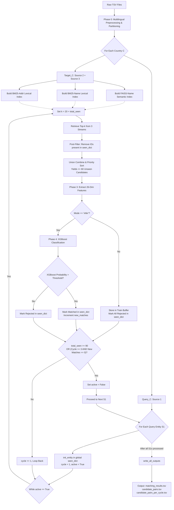

# Implementation Plan v2.3 — Amazon ML Challenge ER Pipeline
### Status: UPDATED — 3-Stream Blocking + Multilingual Transliteration

---

## Change Log

### v2.2 → v2.3 (Multilingual Script Updates)
| Issue | v2.2 | v2.3 Fix |
|---|---|---|
| 🔴 CRITICAL BUG | `encode("ascii")` drops 542k true non-Latin pairs | Script detection + phonetically transliterate Indic scripts |
| 🟠 ARCHITECTURE | Single normalized text column | Dual columns: `name_for_faiss` (orig) vs `name_for_bm25` (Latin/ITRANS) |
| 🟡 FEATURE | Missing cross-script signal | Added `is_cross_script` ML meta-feature |

### v2.1 → v2.2 (3-Stream Architecture)
| # | Change | Detail |
|---|---|---|
| 7 | 2 streams → **3 streams** (BM25-name + BM25-addr + FAISS-name) | No cross-contamination; independent signals; ≤60 candidates/cycle (3×20); `MAX_SEEN` raised 60 → 90 |
| 9 | Feature table expanded: +2 features | `name_bm25_score` and `addr_bm25_score` now separate features; RRF formula updated to 3-stream |

### v1.0 → v2.1 (Audit Fixes)
| Issue | v1.0 | v2.0/v2.1 Fix |
|---|---|---|
| 🔴 BUG 1 | `approach_2.md` inverted direction | Marked DEPRECATED; correct direction documented |
| 🔴 BUG 2 | 1:1 Bipartite post-processing drops valid matches | Removed entirely |
| 🔴 BUG 3 | `candidate_pairs.tsv` written per-cycle (multiple rows) | Dual output: per-cycle file + per-run accumulator file |
| 🟠 GAP 2 | No training data generation step | Explicit 2-mode orchestrator added (train | infer) |
| 🟠 GAP 3 | `seen_list` scope undefined | `seen_list` replaced by global `seen_dict` for O(1) lookups |

---

## 1. Goal Description

Build a robust, scalable Python pipeline that resolves business entity records from 3 independent, noisy sources. The pipeline ingests raw `.tsv` files, cleanly handles multilingual text (Devanagari, Tamil, etc.), runs a Progressive Cyclic DAG combining FAISS semantic search and BM25 lexical search for candidate generation, extracts an 18-dimensional feature vector per candidate pair, and applies a calibrated XGBoost classifier to produce perfectly formatted `matching_results.tsv` and `candidate_pairs.tsv` output files.

---

## 2. Corrected Project Structure

```text
Amazon ML Challange/
├── src/
│   ├── .env                          # Centralized hyperparameter & config tuning
│   ├── main.py                       # CLI entry point (--mode train | infer)
│   ├── config.py                     # Loads .env via python-dotenv -> typed Constants
│   ├── data_layer/
│   │   ├── loader.py                 # Polars TSV loader + null imputation
│   │   └── cleaner.py                # Transliteration + dual representation normalization
│   ├── blocking_layer/
│   │   ├── semantic_index.py         # FAISS + Sentence Transformers (name only)
│   │   ├── lexical_name_index.py     # BM25 char-3gram on name
│   │   ├── lexical_addr_index.py     # BM25 char-3gram on address
│   │   └── seen_dict.py              # Global seen_dict: init, update, write_all_outputs
│   ├── feature_layer/
│   │   └── feature_extractor.py      # 18-dim feature vector per candidate pair
│   ├── ml_layer/
│   │   ├── trainer.py                # XGBoost GroupKFold training + threshold opt
│   │   └── classifier.py            # Load model + online inference
│   └── pipeline/
│       └── orchestrator.py           # 2-mode cyclic DAG (train | infer)
├── output/
│   ├── matching_results.tsv          # Final matches (leaderboard upload)
│   ├── candidate_pairs.tsv           # Per-run accumulator (one row per S1 entity)
│   └── candidate_pairs_per_cycle.tsv # Per-cycle raw log (for debugging)
├── models/
│   └── xgb_model.pkl                 # Saved trained model + optimal threshold
├── notebooks/
│   └── eda.ipynb                     # Step 0: EDA before any code is written
├── utils/
│   └── (validate_submission.py lives in student_resource/utils/)
├── requirements.txt
├── run.sh
└── README.md                         # Exact reproduction instructions
```

---

## 3. Python Dependencies (`requirements.txt`)

```
polars>=0.20.0
numpy>=1.26.0
scikit-learn>=1.4.0
faiss-cpu>=1.7.4
rank-bm25>=0.2.2
sentence-transformers>=2.6.0
xgboost>=2.0.0
lightgbm>=4.3.0
jellyfish>=1.0.0
pyphonetics>=0.5.0
textdistance>=4.6.0
torch>=2.2.0
indic-transliteration>=2.3.62
```

---

## 4. CLI Interface — `run.sh` & `main.py`

```bash
# TRAIN MODE: Runs on training data to generate candidates, label them,
#             train XGBoost, and save model + optimal threshold.
bash run.sh --mode train \
            --data-dir dataset/train \
            --ground-truth dataset/train/train_ground_truth.tsv \
            --model-out models/xgb_model.pkl

# INFER MODE: Loads saved model, runs cyclic DAG on test data,
#             and generates both output files.
bash run.sh --mode infer \
            --data-dir dataset/test \
            --model-in models/xgb_model.pkl \
            --output-dir output/
```

> [!IMPORTANT]
> `run.sh` simply calls `python3 src/main.py` with the same flags. `config.py` stores default paths, thresholds, and hyperparameters. No path is hardcoded anywhere else.

---

## 5. Architectural Decisions (Unchanged from v1.0)

**Decision 1: Polars as Data Engine**
All dataframe operations use Polars (Rust-backed, multi-threaded). Prevents OOM on 2.2M+ row datasets. All string operations use `.str.replace_all()` with regex.

**Decision 2: Local GPU (NVIDIA RTX 3060, 6GB VRAM)**
`paraphrase-multilingual-MiniLM-L12-v2` (~118M params, ~470MB in VRAM). Runs inference with `batch_size=256` on CUDA. Embedding 2.2M records takes ~15–30 min locally instead of days on CPU.

**Decision 3: 2-Mode Orchestrator (RECOMMENDED ARCHITECTURE)**
A single `orchestrator.py` with a `mode` flag is the cleanest architecture:
- **Train mode:** Runs the full Cyclic DAG on training data → generates candidate pairs → joins with `train_ground_truth.tsv` → extracts features → trains and saves XGBoost.
- **Infer mode:** Loads saved model → runs Cyclic DAG on test data → produces output files.

This avoids code duplication, ensures the train and test pipelines are identical (preventing silent distribution drift), and makes the submission's reproduction README trivial.

---

## 6. Phase 0: Preprocessing & Partitioning v2.0 (Multilingual Safe)

Our EDA revealed that **7.10%** of all true match pairs in the ground truth are cross-script (Latin S1 ↔ Indic S2/S3). The previous `NFKD + ASCII encode` pipeline silently destroyed these. We now use a dual-representation transliteration pipeline.

### 6A. High-Speed Data Loading & Imputation
*   **Engine:** `polars.read_csv(separator='\t')`
*   **Literal Null Parsing:** Map common fake-null string literals (`["n/a", "na", "null", "none", "-"]`) to `""`.
*   **Missing Values:** Immediately fill nulls with empty strings `""` to prevent `NoneType` errors.
*   **Data Types:** `country` will be cast to a Categorical type to save memory.

### 6B. Multilingual Script Detection & Transliteration
*   **Script Detection:** We will use regex patterns (`[\u0900-\u097F]` for Devanagari, etc.) to detect Indic scripts (Devanagari, Bengali, Tamil, Telugu, Gujarati, Kannada, Malayalam, Gurmukhi).
*   **Transliteration:** If an Indic script is detected, we will use the `indic-transliteration` library to convert it to the **ITRANS** Roman scheme (phonetic Latin). This allows BM25 char 3-grams to partially overlap with the Latin S1 queries.

### 6C. Dual Representation Text Normalization Pipeline
Since FAISS (MiniLM) and BM25 have fundamentally different requirements for text matching, we generate **two independent representations** for `business_name`.

#### Name for FAISS (`name_for_faiss`)
MiniLM is a multilingual model natively supporting 50+ languages. We must preserve the original script.
*   **Process:** Lowercase -> Trim leading/trailing whitespace -> Collapse multiple spaces into one.
*   **Crucial Rule:** NO NFKD/ASCII encoding, NO transliteration, NO punctuation stripping. (Preserves meaning for semantic embeddings).

#### Name for BM25 (`name_for_bm25`)
BM25 relies on exact character 3-gram overlaps. It requires an aggressively sanitized Latin-only representation.
*   **Transliteration:** If Indic, transliterate to ITRANS.
*   **Unicode Normalization:** Safe `NFKD` encoding and ASCII coercion (`encode("ascii", "ignore").decode()`).
*   **Case & Space:** Lowercase and strip.
*   **Punctuation Stripping:** 
    *   Protect acronyms: Remove periods `.` with no space replacement (`I.B.M.` -> `IBM`).
    *   Map `@` -> ` at ` and `&` -> ` and `.
    *   Remove all remaining non-alphanumeric characters.
*   **Abbreviation Expansion:** Use `\b` anchored regex to expand `corp`->`corporation`, `inc`->`incorporated`, etc.

#### Address Normalization (`addr_for_bm25`)
FAISS is not used on addresses. Addresses are highly structured, so we only need a BM25 representation.
*   **Token-Level Transliteration:** Split the address into words. Transliterate only the Indic tokens, keeping Latin tokens intact.
*   **Standardization:** Apply the same pipeline as `name_for_bm25` (ASCII coercion, lowercase, symbol mapping, punctuation stripping).
*   **Address Abbreviations:** Expand `st`->`street`, `rd`->`road`, etc., using `\b` anchors.

### 6D. Empty String Safety Fallback
*   If any resulting representation is an empty string `""`, we replace it with `f"nullname {entity_id}"` (or `nulladdr {entity_id}`). This creates a globally unique singleton string, avoiding artificial clustering in indices.

### 6E. Detailed Output Expectations (Partitioned Parquet)
The preprocessing script outputs serialized files (e.g., `.parquet` for maximum I/O speed into Phase 1) partitioned by country and split into query vs. target sets (e.g., `Query_india.parquet`, `Target_india.parquet`).

Schema per row:
*   `entity_id` (String): Primary key.
*   `country` (String): Normalized country name.
*   `source` (String): `"S1"`, `"S2"`, or `"S3"`.
*   `name_original` & `addr_original` (String): Raw fields.
*   `name_for_faiss` (String): Lowercased, original script preserved.
*   `name_for_bm25` (String): Latin-only, transliterated, fully normalized.
*   `addr_for_bm25` (String): Latin-only, transliterated, normalized.
*   `is_cross_script` (Int8): `1` if the original name contained Indic scripts, `0` if purely Latin.

---

## 7. Phase 1–2: Blocking Layer (3-Stream)

### 7A. Final Stream Assignment

| # | Stream | Index | Field | Why This, Not Mixed |
|---|---|---|---|---|
| 1 | **BM25-Name** | `BM25Okapi` | `name_for_bm25` (char 3-grams) | Lexically catches name typos, abbreviation variants, transpositions (`Retail Bata` vs `Batra Retail`). Name is short — won't be drowned by address. |
| 2 | **BM25-Addr** | `BM25Okapi` | `addr_for_bm25` (char 3-grams) | Lexically catches address typos, numeric code overlap (ZIP, building numbers). Address is long — its own dedicated index prevents it from drowning the name signal. |
| 3 | **FAISS-Name** | `IndexFlatIP` | `name_for_faiss` (MiniLM embeddings) | Semantically catches synonyms and abbreviations (`IBM` ≈ `International Business Machines`, `Corp` ≈ `Corporation`). |

### 7B. Why FAISS Is Forbidden on Addresses
Semantic models capture *meaning*, not structure. Addresses are structured codes — not prose.
- **Adjacent building numbers look semantically identical:** `123 Main St` vs `124 Main St` embed to nearly identical vectors.
- **BM25 char-3grams already handle address typos natively:** Overlapping 3-grams handle typos perfectly without semantic models.

### 7C. Per-Cycle Candidate Budget

| Stream | k per cycle | Max new candidates after blacklist filter |
|---|---|---|
| BM25-Name | 20 + total_seen | 20 |
| BM25-Addr | 20 + total_seen | 20 |
| FAISS-Name | 20 + total_seen | 20 |
| **Union (≤3×20, deduplicated)** | — | **≤ 60 per cycle** |

**MAX_SEEN updated: 60 → 90**
- 3 streams × 20 candidates × minimum 3 cycles = **90 worst-case unique candidates**
- Stopping condition: `seen_dict[s1_id]["total"] >= 90`

---

## 8. Project DAG & Cycle Breakdown

### 8A. High-Level Data Flow & Cycle Logic
This flowchart illustrates the overarching v2.3 architecture, showing exactly what data is generated, where it is cached, and how the engines interact within the cycle.

```mermaid
graph TD
    %% Global Data Stores
    D1[("Target Database (S2 + S3)")]
    D2[("Query Database (S1)")]
    D3[("Seen Dict Cache (Global)")]
    D4[("Output Files (3 TSVs)")]
    
    %% Core Engines
    E1["1. Blocking Engine (3-Streams)"]
    E2["2. Feature Extraction Engine"]
    E3["3. ML Classification Engine (XGBoost)"]
    
    %% Flow
    D2 -->|S1 Query| E1
    D1 -->|Target Index Search| E1
    D3 -.->|Blacklist Filter O(1)| E1
    
    E1 -->|Top <=60 Unseen Candidates| E2
    E2 -->|26-Dim Feature Vectors| E3
    E3 -->|Probabilities| R{Threshold Met?}
    
    R -->|Yes/No| D3
    D3 -.->|Single Pass Write| D4
    
    %% Cycle Logic
    R --> C{"Stop Metric Reached?<br>(total_seen >= 90 OR 0 New Matches in Cycle 3)"}
    C -->|No: Increment Cycle| E1
    C -->|Yes: Terminate Cycle| Next[Proceed to Next S1 Query]
```

### 8B. Detailed Execution Architecture
This flowchart breaks down the internal mechanics of each engine and the exact stepwise logic of the DAG.



### 8C. Global `seen_dict` — Design & Data Structure

**`seen_list` (local per-entity list) has been replaced by `seen_dict` (global nested dictionary).** `seen_dict` is initialized once before the outer loop and never cleared — it is the single source of truth for all 3 output files.

```python
seen_dict["S1-00001"] = {
    "accepted"  : set(),    # Confirmed matches → matching_results.tsv
    "rejected"  : set(),    # ML-rejected candidates (blacklisted from next cycle)
    "seen_ids"  : set(),    # Union of accepted + rejected (O(1) blacklist lookup)
    "total"     : int,      # len(seen_ids) — used for k = 20 + total
    "per_cycle" : dict,     # { cycle_num (int): [list of candidate_ids (str)] }
}
```

### 8D. Dual Candidate Output Files

| File | Rows per S1 Entity | Written When | Source in `seen_dict` |
|---|---|---|---|
| `candidate_pairs.tsv` | **Exactly 1** | After ALL entities processed | `accepted` ∪ `rejected` |
| `candidate_pairs_per_cycle.tsv` | **One per cycle** | After ALL entities processed | `per_cycle[1]`, `per_cycle[2]`, ... |
| `matching_results.tsv` | **Exactly 1** | After ALL entities processed | `accepted` only |

### 8E. Full Orchestrator Pseudocode (3 Streams)

```python
def run_orchestrator(mode, query_c, target_c,
                     bm25_name_index, bm25_addr_index, faiss_index,
                     s1_name_embs, model, threshold):

    seen_dict = {}

    for s1_entity in query_c.iter_rows(named=True):
        s1_id = s1_entity["entity_id"]
        init_entity(seen_dict, s1_id)

        cycle  = 1
        active = True
        new_matches_this_cycle = 0

        # Pre-compute query representations once per entity
        s1_name_3grams = to_char_3grams(s1_entity["name_for_bm25"])
        s1_addr_3grams = to_char_3grams(s1_entity["addr_for_bm25"])
        s1_name_emb    = s1_name_embs[s1_entity["row_index"]]

        while active:
            k = 20 + seen_dict[s1_id]["total"]

            # ── RETRIEVE (3 independent streams) ────────────────────────────────────
            bm25_name_results = bm25_name_index.get_top_n(s1_name_3grams, target_ids, n=k)
            bm25_addr_results = bm25_addr_index.get_top_n(s1_addr_3grams, target_ids, n=k)
            faiss_scores, faiss_indices = faiss_index.search(s1_name_emb.reshape(1, -1), k)
            faiss_results = format_faiss_results(faiss_scores, faiss_indices, target_ids)

            # ── FILTER BLACKLIST ──────────────────────────
            blacklist = seen_dict[s1_id]["seen_ids"]
            new_bm25_name = [x for x in bm25_name_results if x["id"] not in blacklist][:20]
            new_bm25_addr = [x for x in bm25_addr_results if x["id"] not in blacklist][:20]
            new_faiss     = [x for x in faiss_results     if x["id"] not in blacklist][:20]

            # ── UNION & PRIORITY SORT ────────────────────────────────────────────────
            # Priority: in all 3 streams > in 2 streams > in 1 stream only
            union_candidates = priority_deduplicate(new_bm25_name, new_bm25_addr, new_faiss)

            if len(union_candidates) == 0:
                active = False
                break

            # ── FEATURE EXTRACTION & ML SCORING ─────────────────────────────────────
            features = extract_features(s1_entity, union_candidates)
            new_matches_this_cycle = 0

            if mode == "train":
                store_training_pairs(s1_id, union_candidates, features)
                for cand in union_candidates:
                    update_seen(seen_dict, s1_id, cand["id"], accepted=False, cycle=cycle)
            else:
                probs = model.predict_proba(features)[:, 1]
                for cand, prob in zip(union_candidates, probs):
                    is_match = prob > threshold
                    update_seen(seen_dict, s1_id, cand["id"], accepted=is_match, cycle=cycle)
                    if is_match:
                        new_matches_this_cycle += 1

            # ── STOPPING CONDITION ────────────────────────────────────────────────────
            total_seen = seen_dict[s1_id]["total"]
            if total_seen >= 90 or (cycle >= 3 and new_matches_this_cycle == 0):
                active = False
            else:
                cycle += 1

    # Single pass output writer
    write_all_outputs(seen_dict, mode)
```

---

## 9. Phase 3: Feature Engineering (26-Dim Vector)

> **Note:** Expanded from the original 18-dim spec to 26-dim in `Feature_Engineering_1.0.md v5.0`. See that document for full implementation rules (symmetric Monge-Elkan, `compute_bm25_self_score()` pseudocode, phonetic word-level hashing, etc.).

| Dim | Feature | Method | Stream Source |
|---|---|---|---|
| 1 | Name Jaro-Winkler Similarity | `jellyfish.jaro_winkler_similarity` | — |
| 2 | Name Monge-Elkan Distance (Symmetric Avg) | `textdistance.MongeElkan` — average ME(A,B) and ME(B,A) | — |
| 3 | Name Levenshtein Similarity | `1.0 - (jellyfish.levenshtein_distance / max_len)` | — |
| 4 | Exact Name Match | Binary flag | — |
| 5 | Name Phonetic Match (Word-Level Set Intersect) | `pyphonetics` Double Metaphone (primary code) per word → set intersect | — |
| 6 | Acronym Score (Symmetric, Edge-Case Safe) | Jaro-Winkler(initials, other) — symmetric max | — |
| 7 | Name Semantic Cosine | L2-normalized MiniLM embedding dot product (clamped `max(0, x)`) | FAISS-Name |
| 8 | Addr Token Jaccard | `.split()` tokenize → `\|intersect\| / \|union\|` | BM25-Addr |
| 9 | Addr Token Containment | `.split()` tokenize → `\|intersect\| / min(\|A\|, \|B\|)` | BM25-Addr |
| 10 | Exact Address Match | Binary flag | — |
| 11 | Addr Numeric Jaccard | `re.findall(r'\d+')` → set IoU (guard `0/0`) | — |
| 12 | Addr Numeric Exact (Ternary: 1/0/-1) | Set comparison; -1 if no numbers in either | — |
| 13 | Addr Numeric Exists Both | Binary: both address sets non-empty? | — |
| 14 | **Name BM25 Score (Self-Normalized)** | `name_bm25_score / compute_bm25_self_score(query, index)` | BM25-Name |
| 15 | **Addr BM25 Score (Self-Normalized)** | `addr_bm25_score / compute_bm25_self_score(query, index)` | BM25-Addr |
| 16 | **RRF Score (3-stream)** | `1/(60+bm25_name_rank) + 1/(60+bm25_addr_rank) + 1/(60+faiss_rank)` | All 3 |
| 17 | **Stream Overlap Count** | `0/1/2/3` — how many streams retrieved this candidate | All 3 |
| 18 | Name Length Ratio | `min(len_a, len_b) / max(len_a, len_b)` (character units) | — |
| 19 | Addr Length Ratio | Same formula | — |
| 20 | S1 Name Is Missing | Binary: S1 `name_for_bm25`.startswith("nullname") | — |
| 21 | Cand Name Is Missing | Binary: Candidate `name_for_bm25`.startswith("nullname") | — |
| 22 | S1 Addr Is Missing | Binary: S1 `addr_for_bm25`.startswith("nulladdr") | — |
| 23 | Cand Addr Is Missing | Binary: Candidate `addr_for_bm25`.startswith("nulladdr") | — |
| Meta 24 | **Cross-Script Target?** | `is_cross_script` binary flag from Phase 0 Preprocessing | — |
| Meta 25 | Source Origin | One-hot: S2=0, S3=1 | — |
| Meta 26 | Country Target Encoded | `sklearn.TargetEncoder(cv=5)` — fold-internal; global mean fallback for unseen countries (France) | — |

---

## 10. Phase 4: ML Classification

- **Model:** XGBoost (primary) / LightGBM (fallback)
- **Class Imbalance:** `scale_pos_weight = count(negatives) / count(positives)`
- **Monotonic Constraints:** We use a precise 26-dim constraint vector (`+1` for pure similarity features like Jaro-Winkler, `0` for categorical/ternary features like missing flags or length ratios). This mathematically eliminates overfitting to non-logical training outliers.
- **Validation:** GroupKFold (k=5) grouped by `source1_entity_id`
- **Threshold Calibration:** Grid search `[0.5 → 0.99, step=0.01]` on Macro F_0.5

### 10A. Monotonic Constraints Vector (26-Dim)

| Dim | Feature | Constraint | Reasoning |
|---|---|---|---|
| 1 | Name Jaro-Winkler | `+1` | Higher = more similar = more likely match |
| 2 | Name Monge-Elkan (Symmetric Avg) | `+1` | Higher = more similar |
| 3 | Name Levenshtein Similarity | `+1` | Higher = more similar |
| 4 | Exact Name Match | `+1` | `1` is strictly better than `0` |
| 5 | Name Phonetic Match | `+1` | More phonetic overlap = more likely match |
| 6 | Acronym Score | `+1` | Higher = better acronym alignment |
| 7 | Name Semantic Cosine | `+1` | Higher cosine = more semantically similar |
| 8 | Addr Token Jaccard | `+1` | Higher overlap = more likely match |
| 9 | Addr Token Containment | `+1` | Higher containment = more likely match |
| 10 | Exact Address Match | `+1` | Binary, `1` is strictly better |
| 11 | Addr Numeric Jaccard | `+1` | Higher numeric overlap = more likely match |
| 12 | Addr Numeric Exact (Ternary: 1/0/-1) | `0` | **Not monotone.** `-1` means "no numbers in either" — a neutral/unknown signal, not a negative one. XGBoost needs freedom to learn split rules here |
| 13 | Addr Numeric Exists Both | `0` | **Not monotone.** Both having numbers doesn't mean they match. It's a quality-of-evidence flag, not a similarity measure |
| 14 | Name BM25 Score (Self-Normalized) | `+1` | Higher score = stronger lexical name match |
| 15 | Addr BM25 Score (Self-Normalized) | `+1` | Higher score = stronger lexical address match |
| 16 | RRF Score (3-stream) | `+1` | Higher RRF = retrieved higher across more streams = more likely match |
| 17 | Stream Overlap Count (0/1/2/3) | `+1` | Found in more streams = more robust candidate |
| 18 | Name Length Ratio | `0` | **Not monotone.** Very short names with ratio ≈ 1.0 could be generic (e.g., `"Co"` vs `"Co"`). XGBoost should learn the sweet spot freely |
| 19 | Addr Length Ratio | `0` | Same reasoning as Dim 18 |
| 20 | S1 Name Is Missing | `0` | **Not monotone.** A missing S1 name doesn't increase or decrease match probability monotonically — it changes the *nature* of the inference |
| 21 | Cand Name Is Missing | `0` | Same |
| 22 | S1 Addr Is Missing | `0` | Same |
| 23 | Cand Addr Is Missing | `0` | Same |
| 24 | Cross-Script Target | `0` | **Not monotone.** Cross-script = lower expected BM25 scores (a signal for *interpretation*, not magnitude) |
| 25 | Source Origin (S2=0, S3=1) | `0` | **Not monotone.** Source identity has no inherent match-probability direction |
| 26 | Country Target Encoded | `0` | **Not monotone.** Mean-encoded country value is a learned embedding, not a similarity score |

> [!WARNING]
> **1:1 Bipartite Greedy Post-Processing has been REMOVED.** The problem statement allows S1 → many S2/S3 matches and does not constrain S2/S3 exclusivity. Applying 1:1 assignment would incorrectly drop valid true matches.

---

## 11. Development Steps (9 Steps)

```
Step 0:  EDA (notebooks/eda.ipynb) [COMPLETED - Verified cross-script necessity]

Step 1:  Initialize project structure + requirements.txt + config.py + run.sh.

Step 2:  Write data_layer:
         - loader.py (Polars TSV + null imputation + fake-null detection)
         - cleaner.py (Transliteration via indic-transliteration → dual column generation)

Step 3:  Write blocking_layer:
         - lexical_name_index.py (BM25 on name char-3grams)
         - lexical_addr_index.py (BM25 on address char-3grams)
         - semantic_index.py (FAISS + MiniLM on name ONLY, CUDA)
         - seen_dict.py (global dict: init_entity(), update_seen(), write_all_outputs())

Step 4:  Write feature_layer:
         - feature_extractor.py (all 18 features + meta-features)

Step 5:  Write ml_layer:
         - trainer.py (GroupKFold + monotonic constraints + F_0.5 threshold search)
         - classifier.py (load model + predict_proba + threshold apply)

Step 6:  Write pipeline/orchestrator.py
         - Cyclic DAG (global seen_dict, single-pass output writer, mode=train|infer)

Step 7:  Run TRAIN MODE end-to-end:
         bash run.sh --mode train ...
         → Generates labeled training pairs → trains XGBoost → saves model + threshold.

Step 8:  Run INFER MODE end-to-end:
         bash run.sh --mode infer ...
         → Generates output/matching_results.tsv and output/candidate_pairs.tsv

Step 9:  Validate & Submit:
         python3 utils/validate_submission.py \
             --matching output/matching_results.tsv \
             --candidate output/candidate_pairs.tsv \
             --test-dir dataset/test
         → Must print PASS before any leaderboard upload.
```
